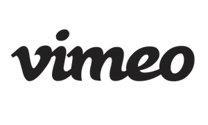

# Loop

 

## Overview 

Watch the world’s best videos from the <a href="https://developer.vimeo.com/api">Vimeo</a> community.  Like videos and add videos to your watch later queue. Now you can cast videos to your TV.

In order to run this project, you must <a href="register your app">Register Your App</a>Loop_Screenshot_Of_Screencast_4.png to get proper credentials such as client_id, client_secret ...  Then you can store these credentials into `/res/values/defaults.xml` . 

Otherwise you can just download the .APK in <a href="https://github.com/lawloretienne/Loop/releases">Releases</a>

## Screencast

